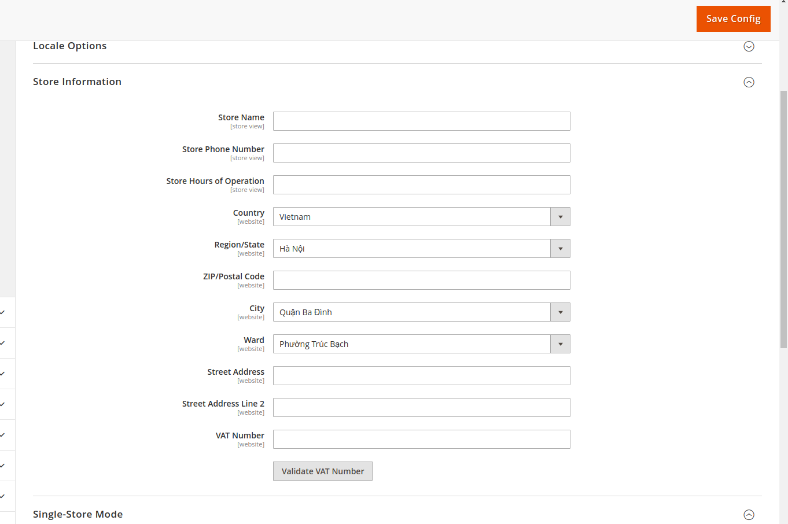

# magento2-dropdown-address
The city and ward will be appear as a dropdown field. So, the customer can easily and effortlessly select a city/ward from the given list of available cities/wards based on the selected country of his/her choice. 

The extension is guaranteed to improve effective engagement with the customers. It makes it dynamic and more appealing along with providing a great user-friendly encounter that ultimately, enhances the final customer experience. Thus will increase your business effectiveness.

## Main Features
---------------
**City and Ward dropdown for Storefront**
* Automatically updates the dropdown list for city and ward without reload page
* City and Ward dropdown for Customer Address Book page
* City and Ward dropdown for Checkout page: Shipping and billing address
* The localized name show on storefront base on store configuration

**City and Ward dropdown for Admin**
* Import the regions, cities, wards base on country by csv file
* City and Ward dropdown for Customer Address Book page
* City and Ward dropdown for Admin Create Order page
* City and Ward dropdown for Address for Stock Source page
* City and Ward dropdown for Configuration page: Store information and Shipping origin
* Manage the regions and localized name
* Manage the cities and localized name
* Manage the wards and localized name

## Screenshots
### Storefront
Checkout Billing Address

Checkout Shipping Address

Customer Address Book

### Admin page
Menu

Region Management

City Management

Customer Address Management

Admin Order Creating

Stock Source Management

### Configuration page
Shipping Origin

Store Information

## Magento Marketplace
https://marketplace.magento.com/ldtsoft-dropdown-address.html

## Contact
https://www.linkedin.com/in/ldt-soft-6490a7204/
